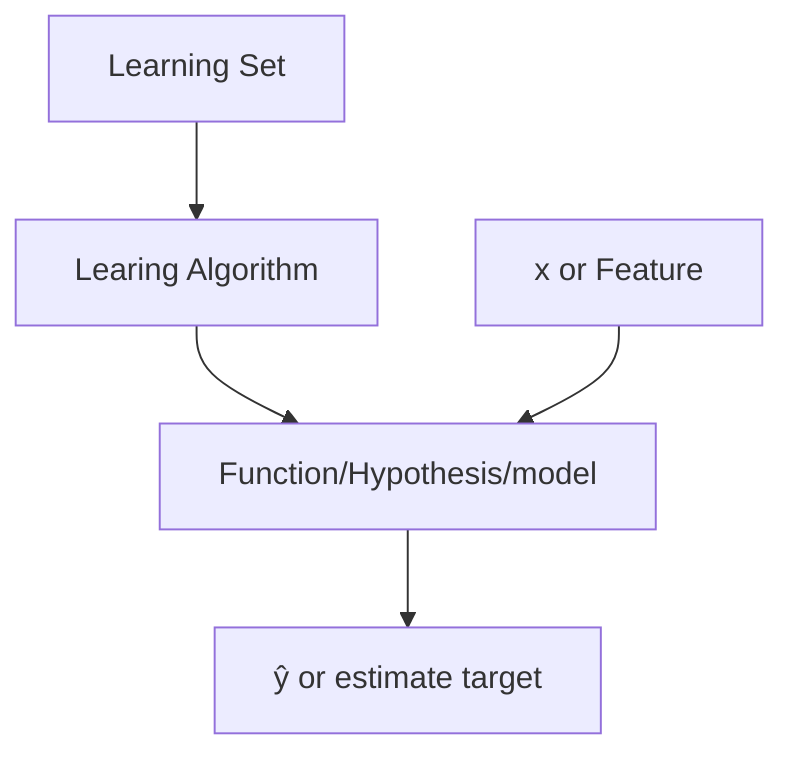

## (Section One) Supervised vs. Unsupervised Machine Learning

What is Machine Learning:
- Machine Learning Algorithms
    - [[../../Supervised Learning|Supervised Learning]]
    - [[../../Unsupervised Learning|Unsupervised Learning]]
    - [[Recommender Systems]]
    - [[Reinforcement Learning]]

## [[../../Supervised Learning|Supervised Learning]]
Are algorithms that take inputs and attempt to produce the correct output label, label meaning correct expected definition of the output.  X to Y mapping. The aspects of the algorithm is to produces a result given the input follows the characteristics "learned"/modeled from the data set.

**[[Regression]]**: Attempting to find a the best expected number from a series of data. It can produced any number, meaning it s output is not necessarily fixed but granular in possible output.

**[[Classification]]**: Is the fixed value expected given an input. Basically categorizing data to fixed labels, and those can be non-numeric.

## [[../../Unsupervised Learning | Unsupervised Learning]]
Are algorithms that take inputs and attempt discover patterns within the data. They are not algorithms that are meant to produces a single result given input. However, rather help define sets and patterns in data. 

[[Clustering]]: Is used to find relational regions of data within a dataset to discover similarities across data. This can be dimensional where we can identify similar relations.

[[Anomaly Detection]]: This algorithm technique is used to discover unusual data points.

[[Dimensionality Reduction]]: Compressing data, while loosing minimal amount of data.

## (Section Two) Regression Model

[[Training Set]]: is the set of data that is used to train the model and its performance. 
    - The input of the training set is know as x, input variable, or feature.
    - For the resulting output of the supervised model, it is denoted as y, output variable, or target variable.
    - m stands for the number of training examples
    - (x, y) represents a training example
    - Specific Training Sample: (x(i), y(i)), where the i represents the index of the training set.
Models typically follow the following design

Linear Regression Formula Representation:
$$
f_{w, b}(x) = wx + b
$$
w = weight of the linear line, changes the intensity of the slope
b = bias of the linear line, changes the y offset of the line

This function allows the learning algorithm to generate the proper linear separation of data. Note there are other mathematical formulations to help separate data however, for the sake of linear regression we are going to stick with the following.
**Univariate**: is the linear regression formulation of one variable of influence.

[[Cost Function Formula]]: The cost function is used to compute the distance of all the data points from the prediction. 

Squared Error Cost Function: is a cost function that is common in ML. For example ŷ - y(i) = the error, and it is a comparison. The way to calculate the full cost of our values we then need to take the total sum of or error squared. This is then divided by the number of elements (2x because it is kinda the same and makes other calculations easier... idk chill dogg), as we want to find the average of our error across our data set. 

$$
\frac{1}{2m}\sum_{i=1}^m(ŷ^{(i)}-y^{(i)})^2
$$

_Worth reviewing this answer as to why we use the square error: https://datascience.stackexchange.com/questions/10188/why-do-cost-functions-use-the-square-error
Basically thought it is to keep the range positive... But has some other math stuff...

